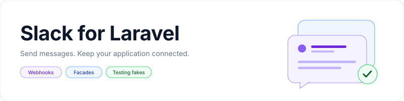

<p align="center">
    <picture>
        <source media="(prefers-color-scheme: dark)" srcset="art/banner-dark.svg">
        <source media="(prefers-color-scheme: light)" srcset="art/banner-light.svg">
        
    </picture>
</p>

<p align="center">Send Slack webhook messages from Laravel or Lumen with a facade, container bindings, and testing fakes.</p>

<p align="center">
    <a href="https://packagist.org/packages/jeremykenedy/slack-laravel"></a>
    <a href="https://packagist.org/packages/jeremykenedy/slack-laravel"></a>
    <a href="https://github.com/jeremykenedy/slack-laravel/actions/workflows/tests.yml"></a>
    <a href="https://github.styleci.io/repos/97894373"></a>
    <a href="LICENSE"></a>
</p>

## Table of Contents

- [Framework Support](#framework-support)
- [Requirements](#requirements)
- [Installation](#installation)
    - [Manual Registration](#manual-registration)
    - [Lumen Registration](#lumen-registration)
- [Quick Start](#quick-start)
    - [Message Options](#message-options)
    - [Sharing Files](#sharing-files)
    - [Dependency Injection](#dependency-injection)
- [Features](#features)
- [Configuration](#configuration)
- [Changing Frameworks](#changing-frameworks)
- [Artisan Commands](#artisan-commands)
- [Testing](#testing)
    - [Faking Messages in Your Application](#faking-messages-in-your-application)
    - [Running the Package Tests](#running-the-package-tests)
- [License](#license)

## Framework Support

| Laravel | PHP versions exercised in CI | Registration |
|---------|------------------------------|--------------|
| 4.2 | 5.6 | Existing legacy provider |
| 5.0 to 5.3 | 5.6 | Manual |
| 5.4 | 7.0 | Manual |
| 5.5 to 5.7 | 7.1 | Package discovery |
| 5.8 and 6 | 7.2 | Package discovery |
| 7 | 7.3 | Package discovery |
| 8 | 7.3, 8.0 | Package discovery |
| 9 | 8.0 | Package discovery |
| 10 | 8.1 | Package discovery |
| 11 | 8.2 | Package discovery |
| 12 | 8.2, 8.3, 8.4, 8.5 | Package discovery |
| 13 | 8.3, 8.4, 8.5 | Package discovery |

| Lumen | PHP versions exercised in CI | Registration |
|-------|------------------------------|--------------|
| 5.0 to 5.3 | 5.6 | Manual |
| 5.4 | 7.0 | Manual |
| 5.5 to 5.7 | 7.1 | Manual |
| 5.8 and 6 | 7.2 | Manual |
| 7 and 8 | 7.3 | Manual |
| 9 | 8.0 | Manual |
| 10 | 8.1 | Manual |
| 11 | 8.2, 8.5 | Manual |

These are compatibility checks, not a recommendation to run an unsupported PHP or framework release. Your application must also meet its framework version's requirements. The legacy Laravel 4 provider and `slack::` configuration bindings remain available for existing installations.

The package runs on the server. Blade, Livewire, Vue, React, and Svelte applications use the same PHP integration. There are no package views, CSS assets, or JavaScript dependencies.

## Requirements

- PHP 5.6.4 or newer, with `mbstring` enabled.
- Laravel or Lumen and the PHP extensions required by your framework version.
- An incoming webhook from your Slack workspace.

The existing `jeremykenedy/slack` 2.x dependency and PHP minimum are unchanged. See the [upgrade notes](docs/upgrading.md) for compatibility details and the upstream PHP 8.4+ deprecation.

## Installation

```bash
composer require jeremykenedy/slack-laravel
php artisan slack:install
```

Laravel 5.5 and newer discover the provider and `Slack` alias automatically. On older Laravel versions and Lumen, register the provider first using the instructions below.

The install command detects `config/slack.php` and leaves an existing file unchanged. It runs without prompts, does not send a test message, and does not edit `.env`. Install/update commands are available on Laravel 5 and newer and on Lumen.

[Create an incoming webhook](https://docs.slack.dev/messaging/sending-messages-using-incoming-webhooks/) and set its URL in your application's environment:

```dotenv
DEFAULT_SLACK_WEBHOOK_ENDPOINT=https://hooks.slack.com/services/REPLACE/WITH/YOUR_WEBHOOK
```

Keep the webhook URL private. If your application caches configuration, run `php artisan config:cache` after changing these settings.

### Manual Registration

For Laravel 5.0 to 5.4, add the provider and alias to the existing arrays in `config/app.php`:

```php
'providers' => [
    jeremykenedy\Slack\Laravel\ServiceProvider::class,
],

'aliases' => [
    'Slack' => jeremykenedy\Slack\Laravel\Facade::class,
],
```

The original publish command remains available:

```bash
php artisan vendor:publish --tag=slacklaravel
```

### Lumen Registration

After installing the Composer package, register the provider in `bootstrap/app.php`, after creating `$app` and before returning it:

```php
$app->register(jeremykenedy\Slack\Laravel\ServiceProvider::class);
```

The provider loads `config/slack.php` and merges any missing package defaults. An existing `$app->configure('slack')` call can stay in place. Constructor injection works without enabling facades.

To use the facade, enable facades in the same bootstrap file. Add the alias only if you want to call `\Slack` instead of importing the package facade:

```php
$app->withFacades();

class_alias(jeremykenedy\Slack\Laravel\Facade::class, 'Slack');
```

Run `php artisan slack:install` to create `config/slack.php` if it is missing. Both `slack:install` and `slack:update` preserve existing files. Use these package commands on Lumen; Laravel's `vendor:publish` and `config:cache` commands are not required or registered by this package.

## Quick Start

Call the facade from a controller, job, listener, or other server-side application code:

```php
use jeremykenedy\Slack\Laravel\Facade as Slack;

Slack::send('The deployment completed.');
```

The existing `\Slack::send(...)` alias works too. For Blade and Livewire applications, send messages from PHP actions. For Vue, React, or Svelte applications, send them from an authenticated Laravel endpoint or job. Do not expose webhook URLs to browser code.

### Message Options

```php
Slack::from('Release bot')->send('Version 2.7 is ready.');
Slack::to('#releases')->send('The deployment completed.');
Slack::to('@username')->send('Your export is ready.');
```

Channel, username, icon, and direct-message overrides depend on your webhook type. [Modern Slack app webhooks use the channel and identity configured in Slack](https://docs.slack.dev/messaging/sending-messages-using-incoming-webhooks/); the override methods remain available for legacy integrations.

For attachments and other message options, see the [Slack PHP client](https://github.com/jeremykenedy/slack).

### Sharing Files

Incoming webhooks send messages. Their attachments format message content; they do not upload local files.

To share an error log with this package, provide a download link that your intended readers can access:

```php
Slack::send('Error log: <https://example.com/logs/download/123|Download log>');
```

Keep the download protected and remove credentials and personal information from logs before sharing them.

To upload the file into Slack itself, use the separate [Slack Files API](https://docs.slack.dev/messaging/working-with-files/) with a bot or user token that has the `files:write` scope:

1. Call `files.getUploadURLExternal` with the filename and its length in bytes.
2. POST the file contents to the returned `upload_url`.
3. Call `files.completeUploadExternal` with the returned file ID and the destination `channel_id`.

The token must have access to the destination channel. These calls use token authentication, not the incoming webhook URL, and are outside this package's webhook client.

### Dependency Injection

The facade and the concrete client resolve to the same shared instance:

```php
use jeremykenedy\Slack\Client;

class SendReleaseNotice
{
    private $slack;

    public function __construct(Client $slack)
    {
        $this->slack = $slack;
    }

    public function send($version)
    {
        $this->slack->send('Released '.$version);
    }
}
```

## Features

- Laravel package discovery and manual Laravel/Lumen provider registration.
- A shared client available through the facade or constructor injection.
- Existing environment variables and configuration publishing support.
- Install and update commands that preserve application configuration.
- Message fakes with channel-specific assertions and no webhook requests.
- Compatibility tests across legacy and current Laravel and Lumen releases.

## Configuration

Settings live in `config/slack.php`. Unpublished settings fall back to the package defaults on Laravel 5 and newer and on Lumen.

| Key | Environment variable | Default |
|-----|----------------------|---------|
| `endpoint` | `DEFAULT_SLACK_WEBHOOK_ENDPOINT` | Empty string |
| `channel` | `DEFAULT_SLACK_CHANNEL` | `#general` |
| `username` | `DEFAULT_SLACK_USERNAME` | `Robot` |
| `icon` | `DEFAULT_SLACK_ICON` | `null` |
| `link_names` | `DEFAULT_SLACK_LINKNAMES_CONVERTED` | `false` |
| `unfurl_links` | `DEFAULT_SLACK_UNFURL_LINKS_STATUS` | `false` |
| `unfurl_media` | `DEFAULT_SLACK_UNFURL_MEDIA_STATUS` | `true` |
| `allow_markdown` | `DEFAULT_SLACK_ALLOW_MARKDOWN` | `true` |
| `markdown_in_attachments` | `DEFAULT_SLACK_MARKDOWN_FIELDS` | `[]` |

Use a comma-separated list for attachment Markdown fields:

```dotenv
DEFAULT_SLACK_MARKDOWN_FIELDS=text,title
```

The previously documented `"'text','title'"` value is also accepted. Applications with an older published configuration should change that entry to a PHP array such as `['text', 'title']`, or adopt the parser from [the current configuration](src/config/config.php). The update command deliberately leaves published files alone.

Set `channel`, `username`, or `icon` to `null` in your configuration to use the webhook defaults. The [Slack PHP client](https://github.com/jeremykenedy/slack) controls transport behavior; this integration does not add automatic retries, which could duplicate messages.

## Changing Frameworks

This package does not choose or install a frontend framework. Existing Bootstrap, Bootstrap 5, Tailwind, Blade, Livewire, Vue, React, and Svelte applications keep their current views and build configuration after `composer update`.

Run the update command to publish configuration only if it is missing:

```bash
php artisan slack:update
```

No CSS/frontend selection, switch command, optional UI packages, or frontend rebuild is needed for this integration. If you change your application's frontend separately, follow that frontend's build instructions.

## Artisan Commands

| Command | Description | Options |
|---------|-------------|---------|
| `slack:install` | Publish missing configuration; detect and preserve an existing installation. | Standard Artisan options only |
| `slack:update` | Publish configuration if missing; leave existing settings untouched. | Standard Artisan options only |
| `vendor:publish --tag=slacklaravel` | Original Laravel configuration publishing command. | Laravel's `vendor:publish` options |

Both package commands work with `--no-interaction`. They do not accept `--force`, `--css`, or `--frontend`, and never overwrite your configuration. Composer updates do not run either command automatically.

## Testing

### Faking Messages in Your Application

```php
use jeremykenedy\Slack\Laravel\Facade as Slack;

Slack::fake();

Slack::to('#releases')->send('Release ready');

Slack::assertMessageSent();
Slack::assertMessageSentTo('#releases');

Slack::assertMessageSentTo('#releases', function ($messages) {
    return $messages->contains(function ($message) {
        return $message->getText() === 'Release ready';
    });
});
```

Fakes retain the client's configured defaults, including changes made before `fake()`. Calling `fake()` again clears recorded messages. Assertion callbacks receive a collection and an optional second argument of `null`, as before. `assertMessageSentTo()` fails when nothing was sent to the requested channel, even without a callback.

The fake intercepts messages sent through the facade or clients resolved from the container after `fake()`. Client instances retained before `fake()` are unchanged.

### Running the Package Tests

```bash
composer install
composer validate --strict
composer lint
composer test
```

The committed lockfile records the development dependencies for PHP 8.4.1 or newer so Dependabot can audit and update them. It does not constrain applications that install this package. When testing this repository on older PHP versions, run `composer update` to resolve compatible development dependencies, as the compatibility jobs do.

Run `pint --test` with [Laravel Pint](https://laravel.com/docs/pint) installed on a current PHP runtime. Pint is kept out of the package's dependencies so older PHP installations can still resolve the package and its tests.

GitHub Actions runs the suite on PHP 5.6 through 8.5, Laravel 4.2 through 13, Lumen 5.0 through 11, and Guzzle 4 through 7. Lumen jobs install `laravel/lumen-framework` in place of `laravel/framework` so Laravel helpers cannot hide Lumen compatibility failures. Version-specific provider tests run only on their matching framework. Tests use isolated configuration directories and fake HTTP clients; they do not send messages to Slack.

The formatting job also audits the current dependency set. Older compatibility jobs allow historical dependencies so they can exercise those releases; that does not certify old framework dependencies as secure.

## License

This package is open-sourced software licensed under the [MIT license](LICENSE).
